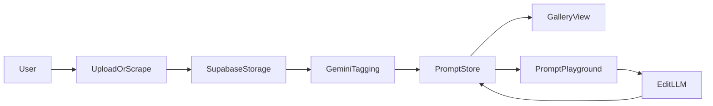

# Promptbox PRD

## Overview
Promptbox is a local Next.js (TypeScript) app that streamlines AI image prompting by organizing image assets, auto-tagging/captioning them with Gemini-3, and enabling a prompt playground to remix and iteratively refine prompts with LLM assistance. Images and metadata are stored in hosted Supabase (Storage + Postgres).

## Goals
- Ingest images or folders from local disk and optionally from gallery-dl sources.
- Auto-generate JSON prompts and natural-language prompts via Gemini-3 with a custom system prompt.
- CRUD prompts and view all prompts tied to each image.
- Provide a slick playground to remix prompts from multiple images, with voice dictation and LLM edits.
- Make prompts easy to copy/paste and iterate on.

## Non-Goals
- No public sharing or collaboration in v1.
- No training or fine-tuning of models.
- No mobile app in v1.

## Assumptions
- App runs locally (Next.js dev or packaged server) while data is stored in hosted Supabase.
- Users provide Gemini-3 and secondary LLM API keys.
- gallery-dl is installed on the host machine and accessible by the backend.

## Personas
- Power Prompter: manages large prompt libraries, wants fast filtering and remixing.
- Visual Curator: focuses on reference images, wants clean metadata and quick prompt export.

## Primary User Journeys
1. Import → Tag → View
   - User drags a folder into the app.
   - Images upload to Supabase Storage; metadata saved.
   - Gemini-3 generates JSON + natural prompt.
   - User views image detail and prompts.
2. Remix → Edit → Export
   - User selects multiple tagged images.
   - User dictates changes or edits prompt segments.
   - Secondary LLM generates updated prompt.
   - User copies/export prompt, saves new version.

## Functional Requirements
### Ingestion and Asset Management
- Upload single images or folders from local disk.
- Optional import via gallery-dl with user-specified URL list and destination.
- Deduplicate assets using a stable hash and store only once.
- Track ingestion job status (queued, running, failed, completed).
- View image gallery with filters by tag, source, and date.

### Tagging and Prompt Generation
- Gemini-3 tagging pipeline:
  - Input: image + optional source metadata.
  - Output: JSON prompt and natural prompt.
- Allow re-run of tagging for selected assets.
- Store multiple prompt versions per image (with timestamps and model metadata).

### Prompt CRUD
- Create, read, update, delete prompts linked to images.
- Show raw JSON prompt and natural prompt side-by-side.
- Support copy-to-clipboard and export as JSON or text.

### Playground
- Multi-select images to build a composite prompt.
- Voice dictation for edits, with text fallback.
- Mix and match elements from selected images (tags, styles, camera, lighting, etc.).
- Secondary LLM generates revised prompts from selected inputs + edit instructions.
- Iteration history stored as versions with easy rollback.

## Non-Functional Requirements
- Performance: gallery loads first 100 thumbnails in <1s on local network.
- Reliability: ingestion must be resumable and idempotent.
- Security: signed URLs for image access; secrets stored server-side only.
- Privacy: no external sharing unless explicitly triggered by user actions.
- Observability: log ingestion, tagging, and LLM failures with trace IDs.
- Rate Limits: backoff and retry for LLM and Supabase APIs.

## Architecture
- Next.js UI for gallery, detail, and playground screens.
- Next.js route handlers for ingestion, tagging, and prompt generation.
- Supabase Storage for images and thumbs, Postgres for metadata and prompts.
- Worker-style background tasks for tagging and thumbnail generation.
- gallery-dl invoked server-side for optional scraping imports.

## Data Model and Storage (Supabase)
### Storage Buckets
- `image_assets`: original images
- `image_thumbs`: generated thumbnails

### Tables
- `image_assets`
  - `id` (uuid, pk)
  - `storage_path` (text, unique)
  - `hash_sha256` (text, unique)
  - `source_type` (text: upload | gallery_dl)
  - `source_ref` (text, nullable)
  - `width` (int), `height` (int), `format` (text)
  - `created_at`, `updated_at`
- `asset_tags`
  - `id` (uuid, pk)
  - `asset_id` (uuid, fk image_assets)
  - `tag` (text)
  - `confidence` (numeric, nullable)
  - `created_at`
- `prompts`
  - `id` (uuid, pk)
  - `asset_id` (uuid, fk image_assets)
  - `json_prompt` (jsonb)
  - `natural_prompt` (text)
  - `model_name` (text)
  - `model_params` (jsonb)
  - `created_at`
- `prompt_versions`
  - `id` (uuid, pk)
  - `prompt_id` (uuid, fk prompts)
  - `version_index` (int)
  - `json_prompt` (jsonb)
  - `natural_prompt` (text)
  - `edit_source` (text: manual | llm | voice)
  - `created_at`
- `ingestion_jobs`
  - `id` (uuid, pk)
  - `status` (text: queued | running | failed | completed)
  - `source_type` (text)
  - `source_ref` (text)
  - `error` (text, nullable)
  - `created_at`, `updated_at`

### Indexes
- `image_assets.hash_sha256` unique index for dedupe.
- `asset_tags.tag` for fast filtering.
- `prompts.asset_id` for prompt lookups by asset.

## Edge Cases
- Duplicate uploads should link to existing assets.
- LLM failures should not block ingestion completion; allow re-try.
- Missing or corrupt images should be skipped with a clear error.
- gallery-dl failures should mark the job failed with captured stdout/stderr.
- Voice dictation unavailable should gracefully fall back to text input.

## LLM Integration
- Gemini-3 tagging uses a custom system prompt to produce both JSON and natural prompt.
- Secondary LLM transforms edits into a new prompt version.
- Store model name, params, and prompt versions for reproducibility.

## UX Requirements
- Gallery grid with fast filter chips and search.
- Image detail view showing:
  - Image preview
  - JSON prompt (formatted)
  - Natural prompt
  - Version history
- Playground:
  - Selected image strip
  - Prompt builder with mixable components
  - Voice dictation control
  - LLM edit preview and accept/reject

## API and Backend Notes
- Next.js route handlers for:
  - Upload + ingestion job creation
  - Tagging pipeline trigger
  - Prompt CRUD
  - Playground edit generation
- Use Supabase signed URLs or proxy endpoints for secure asset access.
- Apply Vercel React best practices for component rendering and data fetching.

## Success Metrics
- <2 minutes to ingest and tag 100 images on a typical machine.
- <5 seconds from edit submission to LLM response for a single prompt.
- 95% successful ingestion jobs without manual intervention.

## Mermaid Flow

